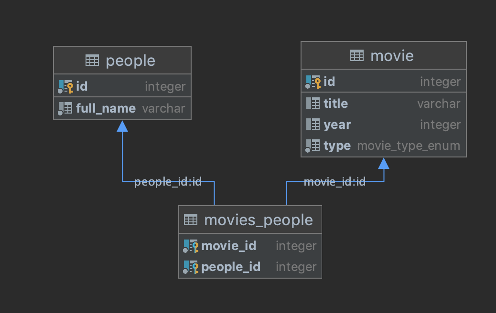

# Movie App

Simple implementation of movie application.⬇️⬇️⬇️

## Technologies

- ### Back end

    - [Koa](https://koajs.com/)- Nodejs framwork for building the REST Apis
    - [Koa-router](https://www.npmjs.com/package/koa-router)- for routing
    - [Typescript](https://www.typescriptlang.org)- for static language
    - [Koa-body](https://koajs.com)- for post routes
    - [@koa/cors](https://www.npmjs.com/package/@koa/cors)- to enable Enable Cross-Origin Requests
    - [Typeorm](https://typeorm.io/#/)- for good sql structure
    - [PostgreSQL](https://www.postgresql.org/)- SQL database
    - [joi](https://github.com/hapijs/joi#readme)- js validation
    - [Koa-multer](https://www.npmjs.com/package/multer)- for uploading images
    - [ESLint](https://eslint.org/)- for good style codding
    - [Prettier](https://prettier.io/)- for good style codding

## ☑ TODO
##**Movie entity**:<br/>

- [x] GET - /api/movie - get all movies<br/>
- [x] POST - /api/movies/:id - get specified movie by id<br/>
- [x] POST - /api/movies - add new movie, requirement parameters are [upload, title, year, type, people]<br/>
- [x] DELETE - /api/movies/:id - delete movie<br/>

##**People entity**:<br/>

- [x] GET - /api/people - get all characters<br/>
- [x] POST - /api/people - add new character, required parameters are [full_name]<br/>

##**Database tables**:<br/>

- movie<br/>
- people<br/>
- movie_people<br/>

</img>

#installation for mac users:

- Before start, you need to install PostgreSQL

```md
> brew install postgresql
```

- Then start the server:

```md
> brew services start postgresql 
```

- Then in sql console write command to create db:

```md
> CREATE DATABASE moviedb; 
```

#usage:

- to start server side

```md
> npm install
```

```md
> npm start
```

- to start client side
```md
> npm install
```

```md
> cd client && npm start
```

## License

MIT

